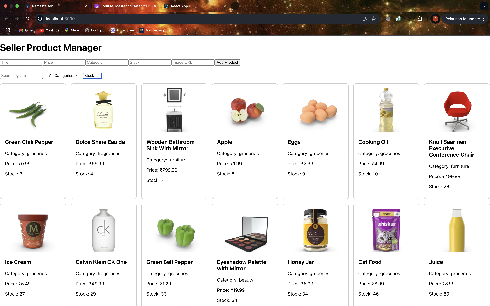
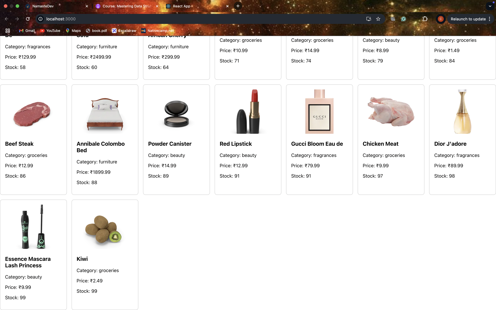

# Seller Product Manager

A responsive and feature-rich product management dashboard built with React and TypeScript. It allows users to view, search, filter, sort, and simulate the addition of products using the DummyJSON API.

---

## Overview

This project demonstrates the core functionality of a seller-side product dashboard, including:

- Fetching real product data from a public API
- Displaying products in a responsive grid
- Searching by product title
- Filtering by category
- Sorting by title, price, or stock
- Adding new products (simulated in local state)

---

## Technologies Used

- React (with Hooks)
- TypeScript
- Axios (for API requests)
- CSS (plain or utility-based styling)
- DummyJSON API

---

## Features

- Product list fetched from the [DummyJSON API](https://dummyjson.com/products)
- Real-time search by title
- Filter by product category
- Sort products by title, price, or stock
- Simulated "Add Product" form that appends new items to the list
- Modular component architecture for reusability and clarity

---

## Images

